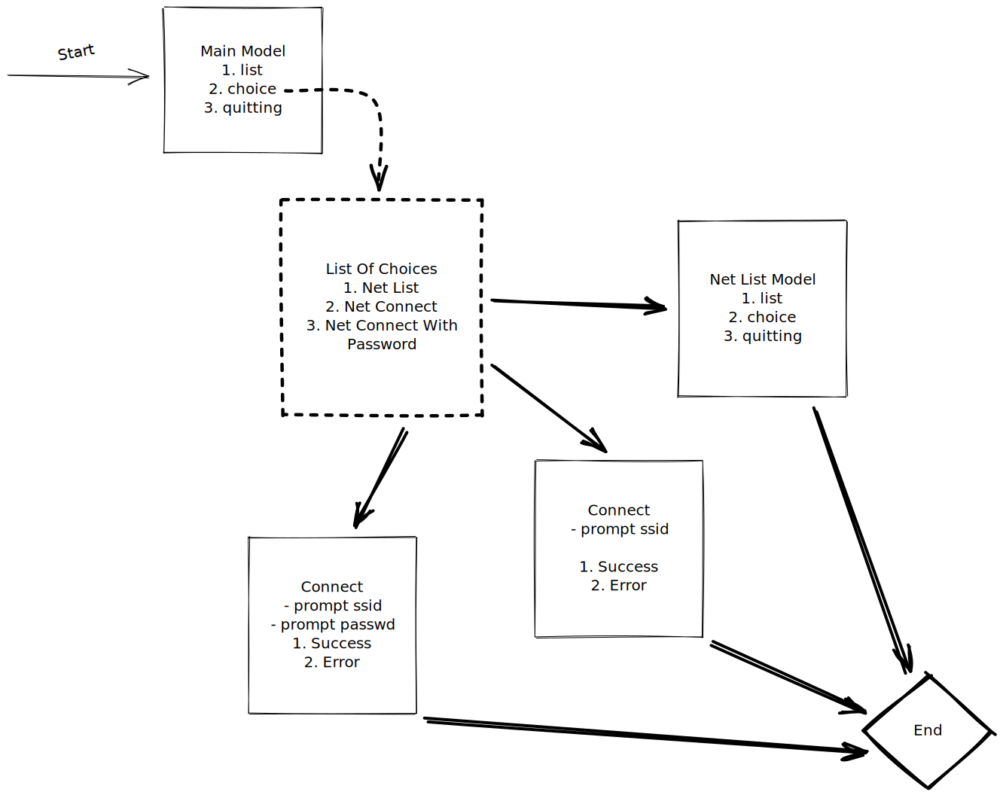

# What is nmcli

nmcli is a command-line tool for controlling NetworkManager and reporting network status. It can be utilized as a replacement for nm-applet or other graphical clients. nmcli is used to create, display, edit, delete, activate, and deactivate network connections, as well as control and display network device status. 

# nmcli-tui

## What is nmcli-tui

- a tui wrapper for nmcli
- I want to be able to use a tui to accomplish network stuff in the command line
  with a tui interface to I do not have to learn the commands by heard
- also want it to look good :)

## Todo

> This is the todo list hope to be able to fill it. [see](#Contribution)

## Concept



## Password

Hide password while typing in go bubbletea-textinput.

```go
t.EchoMode = textinput.EchoPassword
t.EchoCharacter = '•'
```

## Contribution

I'd love people to contribute to this repo! No matter how experienced you are
feel free to make an issue. I'll try to keep a list of todos in the README.md
if I happen to miss a todo or you think something is missing again feel free to
open an issue.

Test are also always welcome!

_Last I want you to know I am not an English mother tongue hance if you find some
grammar or spelling mistakes feel free to make a PR with the description spelling.
Hope I can learn something :)_
